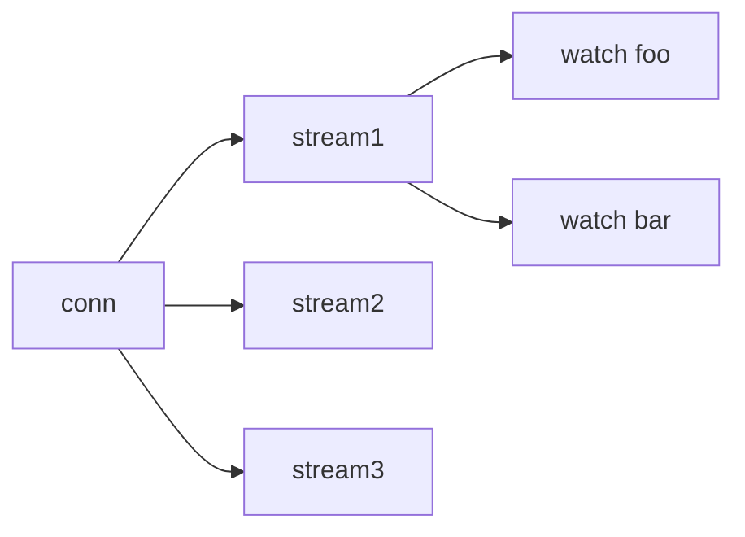

*ПРИМІТКА*: Функції спостереження знаходяться в активній розробці, і їх використання памʼяті може змінюватися в процесі розвитку. Ми не очікуємо значного збільшення понад зазначені нижче цифри.

Основною метою etcd є підтримка дуже великої кількості спостерігачів, які виконують величезну кількість спостережень. etcd прагне підтримувати O(10k) клієнтів, O(100K) потоків спостереження (O(10) потоків на клієнта) і O(10M) загальних спостережень (O(100) спостережень на потік). Памʼять, яку споживає кожне окреме спостереження, становить найбільшу частину загального використання памʼяті etcd, і тому є обʼєктом поточних та майбутніх оптимізацій.

Три повʼязані компоненти спостереження etcd споживають фізичну памʼять: кожен `grpc.Conn`, кожен потік спостереження та кожен екземпляр спостереження. `grpc.Conn` підтримує фактичне TCP-зʼєднання та інший стан зʼєднання gRPC. Кожен `grpc.Conn` споживає O(10kb) памʼяті та може мати кілька прикріплених потоків спостереження.

Кожен потік спостереження є незалежним HTTP2-зʼєднанням, яке споживає ще O(10kb) памʼяті.
Кілька спостережень можуть ділити один потік спостереження.

Спостереження — це фактична структура, яка відстежує зміни в сховищі ключ-значення. Кожне спостереження повинно споживати < O(1kb).

Теоретичне споживання памʼяті спостереження можна приблизно оцінити за формулою:

`memory = c1 * number_of_conn + c2 * avg_number_of_stream_per_conn + c3 * avg_number_of_watch_stream`

## Тестове середовище {#testing-environment}

версія etcd

- git head https://github.com/etcd-io/etcd/commit/185097ffaa627b909007e772c175e8fefac17af3

Тип машини GCE n1-standard-2
- 7.5 ГБ памʼяті
- 2x CPU

## Загальне використання памʼяті {#overall-memory-usage}

Загальне використання памʼяті відображає, скільки [RSS][rss] споживає etcd з клієнтськими спостерігачами. Хоча результат може варіюватися до 10%, він все ще є значущим, оскільки метою є дізнатися про приблизне використання памʼяті та патерн розподілу.

З результатами тесту ми можемо приблизно розрахувати, що `c1 = 17kb`, `c2 = 18kb` і `c3 = 350bytes`. Таким чином, кожне додаткове клієнтське зʼєднання споживає 17kb памʼяті, кожен додатковий потік споживає 18kb памʼяті, а кожне додаткове спостереження споживає лише 350bytes. Один сервер etcd може підтримувати мільйони спостережень з кількома ГБ памʼяті в нормальному випадку.

| клієнти | потоки на клієнта | спостереження на потік | загальне спостереження | використання памʼяті |
|---------|---------|-----------|----------------|--------------|
| 1k |  1 |   1 |   1k |   50MB |
| 2k |  1 |   1 |   2k |   90MB |
| 5k |  1 |   1 |   5k |  200MB |
| 1k | 10 |   1 |  10k |  217MB |
| 2k | 10 |   1 |  20k |  417MB |
| 5k | 10 |   1 |  50k |  980MB |
| 1k | 50 |   1 |  50k | 1001MB |
| 2k | 50 |   1 | 100k | 1960MB |
| 5k | 50 |   1 | 250k | 4700MB |
| 1k | 50 |  10 | 500k | 1171MB |
| 2k | 50 |  10 |   1M | 2371MB |
| 5k | 50 |  10 | 2.5M | 5710MB |
| 1k | 50 | 100 |   5M | 2380MB |
| 2k | 50 | 100 |  10M | 4672MB |
| 5k | 50 | 100 |  25M |  *OOM* |

[rss]: https://en.wikipedia.org/wiki/Resident_set_size
